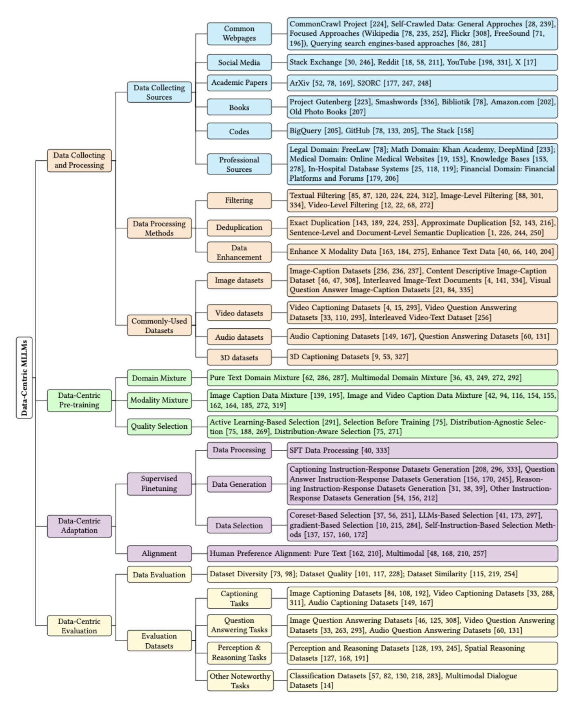

# Data-centric Multimodal LLM

Survey on data-centric multimodal large language models

## Data sources

List of Sources

| Source Name                                  | Source Link                                                  | Type            |
| -------------------------------------------- | ------------------------------------------------------------ | --------------- |
| CommonCrawl                                  | https://commoncrawl.org/                                     | Common Webpages |
| Flickr                                       | https://www.flickr.com/                                      | Common Webpages |
| Flickr Video                                 | https://www.flickr.com/photos/tags/vídeo/                    | Common Webpages |
| FreeSound                                    | [https://freesound.org](https://freesound.org/)              | Common Webpages |
| BBC Sound Effects4                           | [https://sound-effects.bbcrewind.co.uk](https://sound-effects.bbcrewind.co.uk/) | Common Webpages |
| SoundBible                                   | https://soundbible.com/                                      | Common Webpages |
| Wikipedia                                    | https://www.wikipedia.org/                                   | Wikipedia       |
| Wikimedia Commons                            | https://commons.wikimedia.org/                               | Wikipedia       |
| Stack Exchange                               | https://stackexchange.com/                                   | Social Media    |
| Reddit                                       | https://www.reddit.com/                                      | Social Media    |
| Ubuntu IRC                                   | https://ubuntu.com/                                          | Social Media    |
| Youtube                                      | [https://www.youtube.com](https://www.youtube.com/)          | Social Media    |
| X                                            | [https://x.com](https://x.com/)                              | Social Media    |
| S2ORC                                        | https://github.com/allenai/s2orc                             | Academic Papers |
| Arxiv                                        | https://arxiv.org/                                           | Academic Papers |
| Project Gutenberg                            | [https://www.gutenberg.org](https://www.gutenberg.org/)      | Books           |
| Smashwords                                   | https://www.smashwords.com/                                  | Books           |
| Bibliotik                                    | https://bibliotik.me/                                        | Books           |
| National Diet Library                        | https://dl.ndl.go.jp/ja/photo                                | Books           |
| BigQuery public dataset                      | https://cloud.google.com/bigquery/public-data                | Code            |
| GitHub                                       | https://github.com/                                          | Code            |
| FreeLaw                                      | https://www.freelaw.in/                                      | Legal           |
| Chinese legal documents                      | https://www.spp.gov.cn/spp/fl/                               | Legal           |
| Khan Academy exercises                       | [https://www.khanacademy.org](https://www.khanacademy.org/)  | Maths           |
| MEDLINE                                      | [www.medline.com](http://www.medline.com/)                   | Medical         |
| Patient                                      | [https://patient.info](https://patient.info/)                | Medical         |
| WebMD                                        | [https://www.webmd.com](https://www.webmd.com/)              | Medical         |
| NIH                                          | https://www.nih.gov/                                         | Medical         |
| 39 Ask Doctor                                | https://ask.39.net/                                          | Medical         |
| Medical Exams                                | https://drive.google.com/file/d/1ImYUSLk9JbgHXOemfvyiDiirluZHPeQw/view | Medical         |
| Baidu Doctor                                 | https://muzhi.baidu.com/                                     | Medical         |
| 120 Asks                                     | https://www.120ask.com/                                      | Medical         |
| BMJ Case Reports                             | [https://casereports.bmj.com](https://casereports.bmj.com/)  | Medical         |
| XYWY                                         | [http://www.xywy.com](http://www.xywy.com/)                  | Medical         |
| Qianwen Health                               | [https://51zyzy.com](https://51zyzy.com/)                    | Medical         |
| PubMed                                       | [https://pubmed.ncbi.nlm.nih.gov](https://pubmed.ncbi.nlm.nih.gov/) | Medical         |
| EDGAR                                        | https://www.sec.gov/edgar                                    | Financial       |
| SEC Financial Statement and  Notes Data Sets | https://www.sec.gov/dera/data/financial-statement-and-notes-data-set | Financial       |
| Sina Finance                                 | https://finance.sina.com.cn/                                 | Financial       |
| Tencent Finance                              | https://new.qq.com/ch/finance/                               | Financial       |
| Eastmoney                                    | https://www.eastmoney.com/                                   | Financial       |
| Guba                                         | https://guba.eastmoney.com/                                  | Financial       |
| Xueqiu                                       | https://xueqiu.com/                                          | Financial       |
| Phoenix Finance                              | https://finance.ifeng.com/                                   | Financial       |
| 36Kr                                         | https://36kr.com/                                            | Financial       |
| Huxiu                                        | https://www.huxiu.com/                                       | Financial       |

## Commonly-used datasets

Textual-Pretraining Datasets:

| Datasets                  | Link                                                         |
| ------------------------- | ------------------------------------------------------------ |
| RedPajama-Data-1T         | https://www.together.ai/blog/redpajama                       |
| RedPajama-Data-v2         | https://www.together.ai/blog/redpajama-data-v2               |
| SlimPajama                | https://huggingface.co/datasets/cerebras/SlimPajama-627B     |
| Falcon-RefinedWeb         | https://huggingface.co/datasets/tiiuae/falcon-refinedweb     |
| Pile                      | https://github.com/EleutherAI/the-pile?tab=readme-ov-file    |
| ROOTS                     | https://huggingface.co/bigscience-data                       |
| WuDaoCorpora              | https://data.baai.ac.cn/details/WuDaoCorporaText             |
| Common Crawl              | https://commoncrawl.org/                                     |
| C4                        | https://huggingface.co/datasets/c4                           |
| mC4                       | https://arxiv.org/pdf/2010.11934.pdf                         |
| Dolma Dataset             | https://github.com/allenai/dolma                             |
| OSCAR-22.01               | https://oscar-project.github.io/documentation/versions/oscar-2201/ |
| OSCAR-23.01               | https://huggingface.co/datasets/oscar-corpus/OSCAR-2301      |
| colossal-oscar-1.0        | https://huggingface.co/datasets/oscar-corpus/colossal-oscar-1.0 |
| Wiki40b                   | https://www.tensorflow.org/datasets/catalog/wiki40b          |
| Pushshift Reddit Dataset  | https://paperswithcode.com/dataset/pushshift-reddit          |
| OpenWebTextCorpus         | https://paperswithcode.com/dataset/openwebtext               |
| OpenWebText2              | https://openwebtext2.readthedocs.io/en/latest/               |
| BookCorpus                | https://huggingface.co/datasets/bookcorpus                   |
| Gutenberg                 | https://shibamoulilahiri.github.io/gutenberg_dataset.html    |
| CC-Stories-R              | https://paperswithcode.com/dataset/cc-stories                |
| CC-NEWES                  | https://huggingface.co/datasets/cc_news                      |
| REALNEWS                  | https://paperswithcode.com/dataset/realnews                  |
| Reddit submission dataset | https://www.philippsinger.info/reddit/                       |
| General Reddit Dataset    | https://www.tensorflow.org/datasets/catalog/reddit           |
| AMPS                      | https://drive.google.com/file/d/1hQsua3TkpEmcJD_UWQx8dmNdEZPyxw23/view |

MM-Pretraining Datasets:

| Dataset  Name    | Paper Title (with hyperlink)                                 | Modality           |
| ---------------- | ------------------------------------------------------------ | ------------------ |
| ALIGN            | [Scaling up visual and vision-language representation learning   with noisy text supervision](https://huggingface.co/docs/transformers/model_doc/align) | Graph              |
| LTIP             | [Flamingo: a visual language model for few-shot   learning](https://github.com/lucidrains/flamingo-pytorch) | Graph              |
| MS-COCO          | [Microsoft coco: Common objects in context](https://cocodataset.org/#overview) | Graph              |
| Visual Genome    | [Visual genome: Connecting language and vision using crowdsourced dense  image annotations](https://link.springer.com/article/10.1007/S11263-016-0981-7) | Graph              |
| CC3M             | [Conceptual captions: A cleaned, hypernymed, image alt-text   dataset for automatic image captioning](https://aclanthology.org/P18-1238/) | Graph              |
| CC12M            | [Conceptual 12M: Pushing Web-Scale Image-Text   Pre-Training To Recognize Long-Tail Visual Concepts](https://openaccess.thecvf.com/content/CVPR2021/html/Changpinyo_Conceptual_12M_Pushing_Web-Scale_Image-Text_Pre-Training_To_Recognize_Long-Tail_Visual_CVPR_2021_paper.html) | Graph              |
| SBU              | [Im2text: Describing images using 1 million   captioned photographs](https://proceedings.neurips.cc/paper_files/paper/2011/hash/5dd9db5e033da9c6fb5ba83c7a7ebea9-Abstract.html) | Graph              |
| LAION-5B         | [Laion-5b: An open large-scale dataset for training next   generation image-text models](https://laion.ai/blog/laion-5b/) | Graph              |
| LAION-400M       | [Laion-400m: Open dataset of clip-filtered 400 million   image-text pairs](https://arxiv.org/abs/2111.02114) | Graph              |
| LAION-COCO       | [Laion-coco: In the style of MS COCO](https://laion.ai/blog/laion-coco/) | Graph              |
| Flickr30k        | [From image descriptions to visual denotations: New similarity metrics for  semantic inference over event descriptions](https://direct.mit.edu/tacl/article/doi/10.1162/tacl_a_00166/43313/From-image-descriptions-to-visual-denotations-New) | Graph              |
| AI Challenger    | [Ai challenger: A large-scale dataset for going deeper in image   understanding](https://arxiv.org/abs/1711.06475) | Graph              |
| COYO             | [COYO-700M: Image-Text Pair Dataset](https://github.com/kakaobrain/coyo-dataset) | Graph              |
| Wukong           | [Wukong: A 100 million large-scale chinese   cross-modal pre-training benchmark](https://proceedings.neurips.cc/paper_files/paper/2022/hash/a90b9a09a6ee43d6631cf42e225d73b4-Abstract-Datasets_and_Benchmarks.html) | Graph              |
| COCO Caption     | [Microsoft coco captions: Data collection and evaluation server](https://arxiv.org/abs/1504.00325) | Graph              |
| WebLI            | [Pali: A jointly-scaled multilingual language-image model](https://arxiv.org/abs/2209.06794) | Graph              |
| Episodic WebLI   | [Pali-x: On scaling up a multilingual vision and language model](https://arxiv.org/abs/2305.18565) | Graph              |
| CC595k           | [Visual instruction tuning](https://proceedings.neurips.cc/paper_files/paper/2023/hash/6dcf277ea32ce3288914faf369fe6de0-Abstract-Conference.html) | Graph              |
| ReferItGame      | [Referitgame: Referring to objects in photographs of natural   scenes](https://aclanthology.org/D14-1086/) | Graph              |
| RefCOCO&RefCOCO+ | [Modeling context in referring expressions](https://link.springer.com/chapter/10.1007/978-3-319-46475-6_5) | Graph              |
| Visual-7W        | [Visual7w: Grounded question answering in images](https://openaccess.thecvf.com/content_cvpr_2016/html/Zhu_Visual7W_Grounded_Question_CVPR_2016_paper.html) | Graph              |
| OCR-VQA          | [Ocr-vqa: Visual question answering by reading   text in images](https://ieeexplore.ieee.org/abstract/document/8978122) | Graph              |
| ST-VQA           | [Scene text visual question answering](https://openaccess.thecvf.com/content_ICCV_2019/html/Biten_Scene_Text_Visual_Question_Answering_ICCV_2019_paper.html) | Graph              |
| DocVQA           | [Docvqa: A dataset for vqa on document images](https://openaccess.thecvf.com/content/WACV2021/html/Mathew_DocVQA_A_Dataset_for_VQA_on_Document_Images_WACV_2021_paper.html) | Graph              |
| TextVQA          | [Towards vqa models that can read](https://openaccess.thecvf.com/content_CVPR_2019/html/Singh_Towards_VQA_Models_That_Can_Read_CVPR_2019_paper.html) | Graph              |
| DataComp         | [Datacomp: In search of the next generation of   multimodal datasets](https://proceedings.neurips.cc/paper_files/paper/2023/hash/56332d41d55ad7ad8024aac625881be7-Abstract-Datasets_and_Benchmarks.html) | Graph              |
| GQA              | [Gqa: A new dataset for real-world visual   reasoning and compositional question answering](https://openaccess.thecvf.com/content_CVPR_2019/html/Hudson_GQA_A_New_Dataset_for_Real-World_Visual_Reasoning_and_Compositional_CVPR_2019_paper.html) | Graph              |
| VQA              | [VQA: Visual Question Answering](https://openaccess.thecvf.com/content_iccv_2015/html/Antol_VQA_Visual_Question_ICCV_2015_paper.html) | Graph              |
| VQAv2            | [Making   the v in vqa matter: Elevating the role of image understanding in visual   question answering](https://visualqa.org/) | Graph              |
| DVQA             | [Dvqa: Understanding data visualizations via   question answering](http://openaccess.thecvf.com/content_cvpr_2018/html/Kafle_DVQA_Understanding_Data_CVPR_2018_paper.html) | Graph              |
| A-OK-VQA         | [A-okvqa: A benchmark for visual question answering using world  knowledge](https://link.springer.com/chapter/10.1007/978-3-031-20074-8_9) | Graph              |
| Text Captions    | [Textcaps: a dataset for image captioning with reading comprehension](https://link.springer.com/chapter/10.1007/978-3-030-58536-5_44) | Graph              |
| M3W              | [Flamingo: a visual language model for few-shot   learning](https://proceedings.neurips.cc/paper_files/paper/2022/hash/960a172bc7fbf0177ccccbb411a7d800-Abstract-Conference.html) | Graph              |
| MMC4             | [Multimodal c4: An open, billion-scale corpus of   images interleaved with text](https://proceedings.neurips.cc/paper_files/paper/2023/hash/1c6bed78d3813886d3d72595dbecb80b-Abstract-Datasets_and_Benchmarks.html) | Graph              |
| MSRVTT           | [Msr-vtt: A large video description dataset for   bridging video and language](https://ieeexplore.ieee.org/document/7780940/) | Video              |
| WebVid-2M        | [Frozen in time: A joint video and image encoder   for end-to-end retrieval](https://openaccess.thecvf.com/content/ICCV2021/html/Bain_Frozen_in_Time_A_Joint_Video_and_Image_Encoder_for_ICCV_2021_paper.html) | Video              |
| VTP              | [Flamingo: a visual language model for few-shot   learning](https://github.com/lucidrains/flamingo-pytorch) | Video              |
| AISHELL-1        | [Aishell-1: An open-source mandarin speech corpus   and a speech recognition baseline](https://ieeexplore.ieee.org/abstract/document/8384449) | Audio              |
| AISHELL-2        | [Aishell-2: Transforming mandarin asr research into industrial   scale](https://www.aishelltech.com/aishell_2) | Audio              |
| WaveCaps         | [Wavcaps: A chatgpt-assisted weakly-labelled audio captioning   dataset for audio-language multimodal research](https://github.com/XinhaoMei/WavCaps) | Audio              |
| VisDial          | [Visual dialog](https://openaccess.thecvf.com/content_cvpr_2017/html/Das_Visual_Dialog_CVPR_2017_paper.html) | Image              |
| VSDial-CN        | [X-llm: Bootstrapping advanced large language   models by treating multi-modalities as foreign languages](https://github.com/phellonchen/X-LLM/blob/main/README_DATA.md) | Image, Audio       |
| MELON            | [Audio Retrieval for Multimodal Design Documents: A New Dataset   and Algorithms](https://arxiv.org/abs/2302.14757) | Image, Text, Audio |

## Data-centric pretraining

## Data-centric adaptation

## Evaluation

