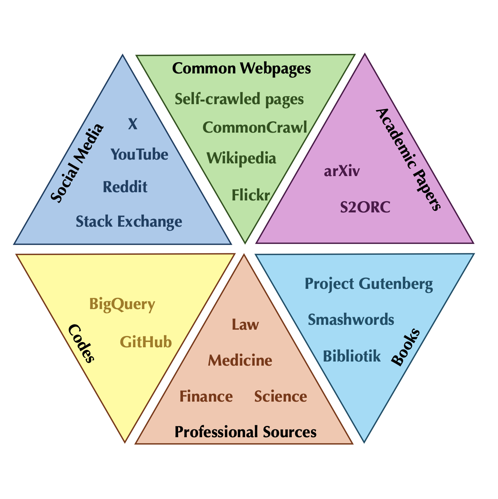

# Data-centric Multimodal LLM

Survey on data-centric multimodal large language models

## Data sources

List of Sources

| Source Name                                  | Source Link                                                  | Type            |
| -------------------------------------------- | ------------------------------------------------------------ | --------------- |
| CommonCrawl                                  | https://commoncrawl.org/                                     | Common Webpages |
| Flickr                                       | https://www.flickr.com/                                      | Common Webpages |
| Flickr Video                                 | https://www.flickr.com/photos/tags/vídeo/                    | Common Webpages |
| FreeSound                                    | [https://freesound.org](https://freesound.org/)              | Common Webpages |
| BBC Sound Effects4                           | [https://sound-effects.bbcrewind.co.uk](https://sound-effects.bbcrewind.co.uk/) | Common Webpages |
| SoundBible                                   | https://soundbible.com/                                      | Common Webpages |
| Wikipedia                                    | https://www.wikipedia.org/                                   | Wikipedia       |
| Wikimedia Commons                            | https://commons.wikimedia.org/                               | Wikipedia       |
| Stack Exchange                               | https://stackexchange.com/                                   | Social Media    |
| Reddit                                       | https://www.reddit.com/                                      | Social Media    |
| Ubuntu IRC                                   | https://ubuntu.com/                                          | Social Media    |
| Youtube                                      | [https://www.youtube.com](https://www.youtube.com/)          | Social Media    |
| X                                            | [https://x.com](https://x.com/)                              | Social Media    |
| S2ORC                                        | https://github.com/allenai/s2orc                             | Academic Papers |
| Arxiv                                        | https://arxiv.org/                                           | Academic Papers |
| Project Gutenberg                            | [https://www.gutenberg.org](https://www.gutenberg.org/)      | Books           |
| Smashwords                                   | https://www.smashwords.com/                                  | Books           |
| Bibliotik                                    | https://bibliotik.me/                                        | Books           |
| National Diet Library                        | https://dl.ndl.go.jp/ja/photo                                | Books           |
| BigQuery public dataset                      | https://cloud.google.com/bigquery/public-data                | Code            |
| GitHub                                       | https://github.com/                                          | Code            |
| FreeLaw                                      | https://www.freelaw.in/                                      | Legal           |
| Chinese legal documents                      | https://www.spp.gov.cn/spp/fl/                               | Legal           |
| Khan Academy exercises                       | [https://www.khanacademy.org](https://www.khanacademy.org/)  | Maths           |
| MEDLINE                                      | [www.medline.com](http://www.medline.com/)                   | Medical         |
| Patient                                      | [https://patient.info](https://patient.info/)                | Medical         |
| WebMD                                        | [https://www.webmd.com](https://www.webmd.com/)              | Medical         |
| NIH                                          | https://www.nih.gov/                                         | Medical         |
| 39 Ask Doctor                                | https://ask.39.net/                                          | Medical         |
| Medical Exams                                | https://drive.google.com/file/d/1ImYUSLk9JbgHXOemfvyiDiirluZHPeQw/view | Medical         |
| Baidu Doctor                                 | https://muzhi.baidu.com/                                     | Medical         |
| 120 Asks                                     | https://www.120ask.com/                                      | Medical         |
| BMJ Case Reports                             | [https://casereports.bmj.com](https://casereports.bmj.com/)  | Medical         |
| XYWY                                         | [http://www.xywy.com](http://www.xywy.com/)                  | Medical         |
| Qianwen Health                               | [https://51zyzy.com](https://51zyzy.com/)                    | Medical         |
| PubMed                                       | [https://pubmed.ncbi.nlm.nih.gov](https://pubmed.ncbi.nlm.nih.gov/) | Medical         |
| EDGAR                                        | https://www.sec.gov/edgar                                    | Financial       |
| SEC Financial Statement and  Notes Data Sets | https://www.sec.gov/dera/data/financial-statement-and-notes-data-set | Financial       |
| Sina Finance                                 | https://finance.sina.com.cn/                                 | Financial       |
| Tencent Finance                              | https://new.qq.com/ch/finance/                               | Financial       |
| Eastmoney                                    | https://www.eastmoney.com/                                   | Financial       |
| Guba                                         | https://guba.eastmoney.com/                                  | Financial       |
| Xueqiu                                       | https://xueqiu.com/                                          | Financial       |
| Phoenix Finance                              | https://finance.ifeng.com/                                   | Financial       |
| 36Kr                                         | https://36kr.com/                                            | Financial       |
| Huxiu                                        | https://www.huxiu.com/                                       | Financial       |

## Commonly-used datasets

Textual-Pretraining Datasets:

| Datasets                  | Link                                                         |
| ------------------------- | ------------------------------------------------------------ |
| RedPajama-Data-1T         | https://www.together.ai/blog/redpajama                       |
| RedPajama-Data-v2         | https://www.together.ai/blog/redpajama-data-v2               |
| SlimPajama                | https://huggingface.co/datasets/cerebras/SlimPajama-627B     |
| Falcon-RefinedWeb         | https://huggingface.co/datasets/tiiuae/falcon-refinedweb     |
| Pile                      | https://github.com/EleutherAI/the-pile?tab=readme-ov-file    |
| ROOTS                     | https://huggingface.co/bigscience-data                       |
| WuDaoCorpora              | https://data.baai.ac.cn/details/WuDaoCorporaText             |
| Common Crawl              | https://commoncrawl.org/                                     |
| C4                        | https://huggingface.co/datasets/c4                           |
| mC4                       | https://arxiv.org/pdf/2010.11934.pdf                         |
| Dolma Dataset             | https://github.com/allenai/dolma                             |
| OSCAR-22.01               | https://oscar-project.github.io/documentation/versions/oscar-2201/ |
| OSCAR-23.01               | https://huggingface.co/datasets/oscar-corpus/OSCAR-2301      |
| colossal-oscar-1.0        | https://huggingface.co/datasets/oscar-corpus/colossal-oscar-1.0 |
| Wiki40b                   | https://www.tensorflow.org/datasets/catalog/wiki40b          |
| Pushshift Reddit Dataset  | https://paperswithcode.com/dataset/pushshift-reddit          |
| OpenWebTextCorpus         | https://paperswithcode.com/dataset/openwebtext               |
| OpenWebText2              | https://openwebtext2.readthedocs.io/en/latest/               |
| BookCorpus                | https://huggingface.co/datasets/bookcorpus                   |
| Gutenberg                 | https://shibamoulilahiri.github.io/gutenberg_dataset.html    |
| CC-Stories-R              | https://paperswithcode.com/dataset/cc-stories                |
| CC-NEWES                  | https://huggingface.co/datasets/cc_news                      |
| REALNEWS                  | https://paperswithcode.com/dataset/realnews                  |
| Reddit submission dataset | https://www.philippsinger.info/reddit/                       |
| General Reddit Dataset    | https://www.tensorflow.org/datasets/catalog/reddit           |
| AMPS                      | https://drive.google.com/file/d/1hQsua3TkpEmcJD_UWQx8dmNdEZPyxw23/view |

MM-Pretraining Datasets:

| Dataset  Name    | Paper Title (with hyperlink)                                 | Modality           |
| ---------------- | ------------------------------------------------------------ | ------------------ |
| ALIGN            | [Scaling up visual and vision-language representation learning   with noisy text supervision](https://huggingface.co/docs/transformers/model_doc/align) | Graph              |
| LTIP             | [Flamingo: a visual language model for few-shot   learning](https://github.com/lucidrains/flamingo-pytorch) | Graph              |
| MS-COCO          | [Microsoft coco: Common objects in context](https://cocodataset.org/#overview) | Graph              |
| Visual Genome    | [Visual genome: Connecting language and vision using crowdsourced dense  image annotations](https://link.springer.com/article/10.1007/S11263-016-0981-7) | Graph              |
| CC3M             | [Conceptual captions: A cleaned, hypernymed, image alt-text   dataset for automatic image captioning](https://aclanthology.org/P18-1238/) | Graph              |
| CC12M            | [Conceptual 12M: Pushing Web-Scale Image-Text   Pre-Training To Recognize Long-Tail Visual Concepts](https://openaccess.thecvf.com/content/CVPR2021/html/Changpinyo_Conceptual_12M_Pushing_Web-Scale_Image-Text_Pre-Training_To_Recognize_Long-Tail_Visual_CVPR_2021_paper.html) | Graph              |
| SBU              | [Im2text: Describing images using 1 million   captioned photographs](https://proceedings.neurips.cc/paper_files/paper/2011/hash/5dd9db5e033da9c6fb5ba83c7a7ebea9-Abstract.html) | Graph              |
| LAION-5B         | [Laion-5b: An open large-scale dataset for training next   generation image-text models](https://laion.ai/blog/laion-5b/) | Graph              |
| LAION-400M       | [Laion-400m: Open dataset of clip-filtered 400 million   image-text pairs](https://arxiv.org/abs/2111.02114) | Graph              |
| LAION-COCO       | [Laion-coco: In the style of MS COCO](https://laion.ai/blog/laion-coco/) | Graph              |
| Flickr30k        | [From image descriptions to visual denotations: New similarity metrics for  semantic inference over event descriptions](https://direct.mit.edu/tacl/article/doi/10.1162/tacl_a_00166/43313/From-image-descriptions-to-visual-denotations-New) | Graph              |
| AI Challenger    | [Ai challenger: A large-scale dataset for going deeper in image   understanding](https://arxiv.org/abs/1711.06475) | Graph              |
| COYO             | [COYO-700M: Image-Text Pair Dataset](https://github.com/kakaobrain/coyo-dataset) | Graph              |
| Wukong           | [Wukong: A 100 million large-scale chinese   cross-modal pre-training benchmark](https://proceedings.neurips.cc/paper_files/paper/2022/hash/a90b9a09a6ee43d6631cf42e225d73b4-Abstract-Datasets_and_Benchmarks.html) | Graph              |
| COCO Caption     | [Microsoft coco captions: Data collection and evaluation server](https://arxiv.org/abs/1504.00325) | Graph              |
| WebLI            | [Pali: A jointly-scaled multilingual language-image model](https://arxiv.org/abs/2209.06794) | Graph              |
| Episodic WebLI   | [Pali-x: On scaling up a multilingual vision and language model](https://arxiv.org/abs/2305.18565) | Graph              |
| CC595k           | [Visual instruction tuning](https://proceedings.neurips.cc/paper_files/paper/2023/hash/6dcf277ea32ce3288914faf369fe6de0-Abstract-Conference.html) | Graph              |
| ReferItGame      | [Referitgame: Referring to objects in photographs of natural   scenes](https://aclanthology.org/D14-1086/) | Graph              |
| RefCOCO&RefCOCO+ | [Modeling context in referring expressions](https://link.springer.com/chapter/10.1007/978-3-319-46475-6_5) | Graph              |
| Visual-7W        | [Visual7w: Grounded question answering in images](https://openaccess.thecvf.com/content_cvpr_2016/html/Zhu_Visual7W_Grounded_Question_CVPR_2016_paper.html) | Graph              |
| OCR-VQA          | [Ocr-vqa: Visual question answering by reading   text in images](https://ieeexplore.ieee.org/abstract/document/8978122) | Graph              |
| ST-VQA           | [Scene text visual question answering](https://openaccess.thecvf.com/content_ICCV_2019/html/Biten_Scene_Text_Visual_Question_Answering_ICCV_2019_paper.html) | Graph              |
| DocVQA           | [Docvqa: A dataset for vqa on document images](https://openaccess.thecvf.com/content/WACV2021/html/Mathew_DocVQA_A_Dataset_for_VQA_on_Document_Images_WACV_2021_paper.html) | Graph              |
| TextVQA          | [Towards vqa models that can read](https://openaccess.thecvf.com/content_CVPR_2019/html/Singh_Towards_VQA_Models_That_Can_Read_CVPR_2019_paper.html) | Graph              |
| DataComp         | [Datacomp: In search of the next generation of   multimodal datasets](https://proceedings.neurips.cc/paper_files/paper/2023/hash/56332d41d55ad7ad8024aac625881be7-Abstract-Datasets_and_Benchmarks.html) | Graph              |
| GQA              | [Gqa: A new dataset for real-world visual   reasoning and compositional question answering](https://openaccess.thecvf.com/content_CVPR_2019/html/Hudson_GQA_A_New_Dataset_for_Real-World_Visual_Reasoning_and_Compositional_CVPR_2019_paper.html) | Graph              |
| VQA              | [VQA: Visual Question Answering](https://openaccess.thecvf.com/content_iccv_2015/html/Antol_VQA_Visual_Question_ICCV_2015_paper.html) | Graph              |
| VQAv2            | [Making   the v in vqa matter: Elevating the role of image understanding in visual   question answering](https://visualqa.org/) | Graph              |
| DVQA             | [Dvqa: Understanding data visualizations via   question answering](http://openaccess.thecvf.com/content_cvpr_2018/html/Kafle_DVQA_Understanding_Data_CVPR_2018_paper.html) | Graph              |
| A-OK-VQA         | [A-okvqa: A benchmark for visual question answering using world  knowledge](https://link.springer.com/chapter/10.1007/978-3-031-20074-8_9) | Graph              |
| Text Captions    | [Textcaps: a dataset for image captioning with reading comprehension](https://link.springer.com/chapter/10.1007/978-3-030-58536-5_44) | Graph              |
| M3W              | [Flamingo: a visual language model for few-shot   learning](https://proceedings.neurips.cc/paper_files/paper/2022/hash/960a172bc7fbf0177ccccbb411a7d800-Abstract-Conference.html) | Graph              |
| MMC4             | [Multimodal c4: An open, billion-scale corpus of   images interleaved with text](https://proceedings.neurips.cc/paper_files/paper/2023/hash/1c6bed78d3813886d3d72595dbecb80b-Abstract-Datasets_and_Benchmarks.html) | Graph              |
| MSRVTT           | [Msr-vtt: A large video description dataset for   bridging video and language](https://ieeexplore.ieee.org/document/7780940/) | Video              |
| WebVid-2M        | [Frozen in time: A joint video and image encoder   for end-to-end retrieval](https://openaccess.thecvf.com/content/ICCV2021/html/Bain_Frozen_in_Time_A_Joint_Video_and_Image_Encoder_for_ICCV_2021_paper.html) | Video              |
| VTP              | [Flamingo: a visual language model for few-shot   learning](https://github.com/lucidrains/flamingo-pytorch) | Video              |
| AISHELL-1        | [Aishell-1: An open-source mandarin speech corpus   and a speech recognition baseline](https://ieeexplore.ieee.org/abstract/document/8384449) | Audio              |
| AISHELL-2        | [Aishell-2: Transforming mandarin asr research into industrial   scale](https://www.aishelltech.com/aishell_2) | Audio              |
| WaveCaps         | [Wavcaps: A chatgpt-assisted weakly-labelled audio captioning   dataset for audio-language multimodal research](https://github.com/XinhaoMei/WavCaps) | Audio              |
| VisDial          | [Visual dialog](https://openaccess.thecvf.com/content_cvpr_2017/html/Das_Visual_Dialog_CVPR_2017_paper.html) | Image              |
| VSDial-CN        | [X-llm: Bootstrapping advanced large language   models by treating multi-modalities as foreign languages](https://github.com/phellonchen/X-LLM/blob/main/README_DATA.md) | Image, Audio       |
| MELON            | [Audio Retrieval for Multimodal Design Documents: A New Dataset   and Algorithms](https://arxiv.org/abs/2302.14757) | Image, Text, Audio |

Common Textual SFT Datasets:

| Dataset  Name                | Language    | Construction  Method | Github Link                                                  | Paper Link                                                   | Dataset Link                                                 |
| ---------------------------- | ----------- | -------------------- | ------------------------------------------------------------ | ------------------------------------------------------------ | ------------------------------------------------------------ |
| databricks-dolly-15K         | EN          | HG                   |                                                              |                                                              | https://huggingface.co/datasets/databricks/databricks-dolly-15k |
| InstructionWild_v2           | EN & ZH     | HG                   | https://github.com/XueFuzhao/InstructionWild                 |                                                              |                                                              |
| LCCC                         | ZH          | HG                   | https://github.com/thu-coai/CDial-GPT                        | https://arxiv.org/pdf/2008.03946.pdf                         |                                                              |
| OASST1                       | Multi (35)  | HG                   | https://github.com/imoneoi/openchat                          | https://arxiv.org/pdf/2309.11235.pdf                         | https://huggingface.co/openchat                              |
| OL-CC                        | ZH          | HG                   |                                                              |                                                              | https://data.baai.ac.cn/details/OL-CC                        |
| Zhihu-KOL                    | ZH          | HG                   | https://github.com/wangrui6/Zhihu-KOL                        | https://huggingface.co/datasets/wangrui6/Zhihu-KOL           |                                                              |
| Aya Dataset                  | Multi (65)  | HG                   |                                                              | https://arxiv.org/abs/2402.06619                             | https://hf.co/datasets/CohereForAI/aya_dataset               |
| InstructIE                   | EN & ZH     | HG                   | https://github.com/zjunlp/KnowLM                             | https://arxiv.org/abs/2305.11527                             | https://huggingface.co/datasets/zjunlp/InstructIE            |
| Alpaca_data                  | EN          | MC                   | https://github.com/tatsu-lab/stanford_alpaca#data-release    |                                                              |                                                              |
| BELLE_Generated_Chat         | ZH          | MC                   | https://github.com/LianjiaTech/BELLE/tree/main/data/10M      | https://huggingface.co/datasets/BelleGroup/generated_chat_0.4M |                                                              |
| BELLE_Multiturn_Chat         | ZH          | MC                   | https://github.com/LianjiaTech/BELLE/tree/main/data/10M      | https://huggingface.co/datasets/BelleGroup/multiturn_chat_0.8M |                                                              |
| BELLE_train_0.5M_CN          | ZH          | MC                   | https://github.com/LianjiaTech/BELLE/tree/main/data/1.5M     | https://huggingface.co/datasets/BelleGroup/train_0.5M_CN     |                                                              |
| BELLE_train_1M_CN            | ZH          | MC                   | https://github.com/LianjiaTech/BELLE/tree/main/data/1.5M     | https://huggingface.co/datasets/BelleGroup/train_1M_CN       |                                                              |
| BELLE_train_2M_CN            | ZH          | MC                   | https://github.com/LianjiaTech/BELLE/tree/main/data/10M      | https://huggingface.co/datasets/BelleGroup/train_2M_CN       |                                                              |
| BELLE_train_3.5M_CN          | ZH          | MC                   | https://github.com/LianjiaTech/BELLE/tree/main/data/10M      | https://huggingface.co/datasets/BelleGroup/train_3.5M_CN     |                                                              |
| CAMEL                        | Multi & PL  | MC                   | https://github.com/camel-ai/camel                            | https://arxiv.org/pdf/2303.17760.pdf                         | https://huggingface.co/camel-ai                              |
| Chatgpt_corpus               | ZH          | MC                   | https://github.com/PlexPt/chatgpt-corpus/releases/tag/3      |                                                              |                                                              |
| InstructionWild_v1           | EN & ZH     | MC                   | https://github.com/XueFuzhao/InstructionWild                 |                                                              |                                                              |
| LMSYS-Chat-1M                | Multi       | MC                   |                                                              | https://arxiv.org/pdf/2309.11998.pdf                         | https://huggingface.co/datasets/lmsys/lmsys-chat-1m          |
| MOSS_002_sft_data            | EN & ZH     | MC                   | https://github.com/OpenLMLab/MOSS                            | https://huggingface.co/datasets/fnlp/moss-002-sft-data       |                                                              |
| MOSS_003_sft_data            | EN & ZH     | MC                   | https://github.com/OpenLMLab/MOSS                            | https://github.com/OpenLMLab/MOSS/tree/main/SFT_data         |                                                              |
| MOSS_003_sft_plugin_data     | EN & ZH     | MC                   | https://github.com/OpenLMLab/MOSS                            | https://github.com/OpenLMLab/MOSS/tree/main/SFT_data/conversations/conversation_with_plugins |                                                              |
| OpenChat                     | EN          | MC                   | https://github.com/imoneoi/openchat                          | https://arxiv.org/pdf/2309.11235.pdf                         | https://huggingface.co/openchat                              |
| RedGPT-Dataset-V1-CN         | ZH          | MC                   | https://github.com/DA-southampton/RedGPT                     |                                                              |                                                              |
| Self-Instruct                | EN          | MC                   | https://github.com/yizhongw/self-instruct                    | https://aclanthology.org/2023.acl-long.754.pdf               |                                                              |
| ShareChat                    | Multi       | MC                   |                                                              |                                                              |                                                              |
| ShareGPT-Chinese-English-90k | EN & ZH     | MC                   | https://github.com/CrazyBoyM/llama2-Chinese-chat             | https://huggingface.co/datasets/shareAI/ShareGPT-Chinese-English-90k |                                                              |
| ShareGPT90K                  | EN          | MC                   |                                                              |                                                              | https://huggingface.co/datasets/RyokoAI/ShareGPT52K          |
| UltraChat                    | EN          | MC                   | https://github.com/thunlp/UltraChat#UltraLM                  | https://arxiv.org/pdf/2305.14233.pdf                         |                                                              |
| Unnatural                    | EN          | MC                   | https://github.com/orhonovich/unnatural-instructions         | https://aclanthology.org/2023.acl-long.806.pdf               |                                                              |
| WebGLM-QA                    | EN          | MC                   | https://github.com/THUDM/WebGLM                              | https://arxiv.org/pdf/2306.07906.pdf                         | https://huggingface.co/datasets/THUDM/webglm-qa              |
| Wizard_evol_instruct_196K    | EN          | MC                   | https://github.com/nlpxucan/WizardLM                         | https://arxiv.org/pdf/2304.12244.pdf                         | https://huggingface.co/datasets/WizardLM/WizardLM_evol_instruct_V2_196k |
| Wizard_evol_instruct_70K     | EN          | MC                   | https://github.com/nlpxucan/WizardLM                         | https://arxiv.org/pdf/2304.12244.pdf                         | https://huggingface.co/datasets/WizardLM/WizardLM_evol_instruct_70k |
| CrossFit                     | EN          | CI                   | https://github.com/INK-USC/CrossFit                          | https://arxiv.org/pdf/2104.08835.pdf                         |                                                              |
| DialogStudio                 | EN          | CI                   | https://github.com/salesforce/DialogStudio                   | https://arxiv.org/pdf/2307.10172.pdf                         | https://huggingface.co/datasets/Salesforce/dialogstudio      |
| Dynosaur                     | EN          | CI                   | https://github.com/WadeYin9712/Dynosaur                      | https://arxiv.org/pdf/2305.14327.pdf                         | https://huggingface.co/datasets?search=dynosaur              |
| Flan-mini                    | EN          | CI                   | https://github.com/declare-lab/flacuna                       | https://arxiv.org/pdf/2307.02053.pdf                         | https://huggingface.co/datasets/declare-lab/flan-mini        |
| Flan                         | Multi       | CI                   | https://github.com/google-research/flan                      | https://arxiv.org/pdf/2109.01652.pdf                         |                                                              |
| Flan                         | Multi       | CI                   | https://github.com/google-research/FLAN/tree/main/flan/v2    | https://arxiv.org/pdf/2301.13688.pdf                         | https://huggingface.co/datasets/SirNeural/flan_v2            |
| InstructDial                 | EN          | CI                   | https://github.com/prakharguptaz/Instructdial                | https://arxiv.org/pdf/2205.12673.pdf                         |                                                              |
| NATURAL INSTRUCTIONS         | EN          | CI                   | https://github.com/allenai/natural-instructions              | https://aclanthology.org/2022.acl-long.244.pdf               | https://instructions.apps.allenai.org/                       |
| OIG                          | EN          | CI                   |                                                              |                                                              | https://huggingface.co/datasets/laion/OIG                    |
| Open-Platypus                | EN          | CI                   | https://github.com/arielnlee/Platypus                        | https://arxiv.org/pdf/2308.07317.pdf                         | https://huggingface.co/datasets/garage-bAInd/Open-Platypus   |
| OPT-IML                      | Multi       | CI                   | https://github.com/facebookresearch/metaseq                  | https://arxiv.org/pdf/2212.12017.pdf                         |                                                              |
| PromptSource                 | EN          | CI                   | https://github.com/bigscience-workshop/promptsource          | https://aclanthology.org/2022.acl-demo.9.pdf                 |                                                              |
| SUPER-NATURAL INSTRUCTIONS   | Multi       | CI                   | https://github.com/allenai/natural-instructions              | https://arxiv.org/pdf/2204.07705.pdf                         |                                                              |
| T0                           | EN          | CI                   |                                                              | https://arxiv.org/pdf/2110.08207.pdf                         |                                                              |
| UnifiedSKG                   | EN          | CI                   | https://github.com/xlang-ai/UnifiedSKG                       | https://arxiv.org/pdf/2201.05966.pdf                         |                                                              |
| xP3                          | Multi (46)  | CI                   | https://github.com/bigscience-workshop/xmtf                  | https://aclanthology.org/2023.acl-long.891.pdf               |                                                              |
| IEPile                       | EN & ZH     | CI                   | https://github.com/zjunlp/IEPile                             | https://arxiv.org/abs/2402.14710                             | https://huggingface.co/datasets/zjunlp/iepile                |
| Firefly                      | ZH          | HG & CI              | https://github.com/yangjianxin1/Firefly                      | https://huggingface.co/datasets/YeungNLP/firefly-train-1.1M  |                                                              |
| LIMA-sft                     | EN          | HG & CI              |                                                              | https://arxiv.org/pdf/2305.11206.pdf                         | https://huggingface.co/datasets/GAIR/lima                    |
| COIG-CQIA                    | ZH          | HG & CI              |                                                              | https://arxiv.org/abs/2403.18058                             | https://huggingface.co/datasets/m-a-p/COIG-CQIA              |
| InstructGPT-sft              | EN          | HG & MC              |                                                              | https://arxiv.org/pdf/2203.02155.pdf                         |                                                              |
| Alpaca_GPT4_data             | EN          | CI & MC              | https://github.com/Instruction-Tuning-with-GPT-4/GPT-4-LLM#data-release | https://arxiv.org/pdf/2304.03277.pdf                         |                                                              |
| Alpaca_GPT4_data_zh          | ZH          | CI & MC              | https://github.com/Instruction-Tuning-with-GPT-4/GPT-4-LLM#data-release | https://huggingface.co/datasets/shibing624/alpaca-zh         |                                                              |
| Bactrain-X                   | Multi (52)  | CI & MC              | https://github.com/mbzuai-nlp/bactrian-x                     | https://arxiv.org/pdf/2305.15011.pdf                         | https://huggingface.co/datasets/MBZUAI/Bactrian-X            |
| Baize                        | EN          | CI & MC              | https://github.com/project-baize/baize-chatbot               | https://arxiv.org/pdf/2304.01196.pdf                         | https://github.com/project-baize/baize-chatbot/tree/main/data |
| GPT4All                      | EN          | CI & MC              | https://github.com/nomic-ai/gpt4all                          | https://gpt4all.io/reports/GPT4All_Technical_Report_3.pdf    | https://huggingface.co/datasets/QingyiSi/Alpaca-CoT/tree/main/GPT4all |
| GuanacoDataset               | Multi       | CI & MC              |                                                              |                                                              | https://huggingface.co/datasets/JosephusCheung/GuanacoDataset |
| LaMini-LM                    | EN          | CI & MC              | https://github.com/mbzuai-nlp/LaMini-LM                      | https://arxiv.org/pdf/2304.14402.pdf                         | https://huggingface.co/datasets/MBZUAI/LaMini-instruction    |
| LogiCoT                      | EN & ZH     | CI & MC              | https://github.com/csitfun/logicot                           | https://arxiv.org/pdf/2305.12147.pdf                         | https://huggingface.co/datasets/csitfun/LogiCoT              |
| LongForm                     | EN          | CI & MC              | https://github.com/akoksal/LongForm                          | https://arxiv.org/pdf/2304.08460.pdf                         | https://huggingface.co/datasets/akoksal/LongForm             |
| Luotuo-QA-B                  | EN & ZH     | CI & MC              | https://github.com/LC1332/Luotuo-QA                          | https://huggingface.co/datasets/Logic123456789/Luotuo-QA-B   |                                                              |
| OpenOrca                     | Multi       | CI & MC              |                                                              | https://arxiv.org/pdf/2306.02707.pdf                         | https://huggingface.co/datasets/Open-Orca/OpenOrca           |
| Wizard_evol_instruct_zh      | ZH          | CI & MC              | https://github.com/LC1332/Chinese-alpaca-lora                | https://huggingface.co/datasets/silk-road/Wizard-LM-Chinese-instruct-evol |                                                              |
| COIG                         | ZH          | HG & CI & MC         | https://github.com/FlagOpen/FlagInstruct                     | https://arxiv.org/pdf/2304.07987.pdf                         | https://huggingface.co/datasets/BAAI/COIG                    |
| HC3                          | EN & ZH     | HG & CI & MC         | https://github.com/Hello-SimpleAI/chatgpt-comparison-detection | https://arxiv.org/pdf/2301.07597.pdf                         |                                                              |
| Phoenix-sft-data-v1          | Multi       | HG & CI & MC         | https://github.com/FreedomIntelligence/LLMZoo                | https://arxiv.org/pdf/2304.10453.pdf                         | https://huggingface.co/datasets/FreedomIntelligence/phoenix-sft-data-v1 |
| TigerBot_sft_en              | EN          | HG & CI & MC         | https://github.com/TigerResearch/TigerBot                    | https://arxiv.org/abs/2312.08688                             | https://huggingface.co/datasets/TigerResearch/sft_en         |
| TigerBot_sft_zh              | ZH          | HG & CI & MC         | https://github.com/TigerResearch/TigerBot                    | https://arxiv.org/abs/2312.08688                             | https://huggingface.co/datasets/TigerResearch/sft_zh         |
| Aya Collection               | Multi (114) | HG & CI & MC         | https://arxiv.org/abs/2402.06619                             | https://hf.co/datasets/CohereForAI/aya_collection            |                                                              |

Domain Specific Textual SFT Datasets:

| Dataset  Name            | Language      | Domain         | Construction Method | Github Link                                             | Paper Link                                                   | Dataset Link                                                 |
| ------------------------ | ------------- | -------------- | ------------------- | ------------------------------------------------------- | ------------------------------------------------------------ | ------------------------------------------------------------ |
| ChatDoctor               | EN            | Medical        | HG & MC             | https://github.com/Kent0n-Li/ChatDoctor                 | https://arxiv.org/ftp/arxiv/papers/2303/2303.14070.pdf       | https://github.com/Kent0n-Li/ChatDoctor                      |
| ChatMed_Consult_Dataset  | ZH            | Medical        | MC                  | https://github.com/michael-wzhu/ChatMed                 | https://huggingface.co/datasets/michaelwzhu/ChatMed_Consult_Dataset |                                                              |
| CMtMedQA                 | ZH            | Medical        | HG                  | https://github.com/SupritYoung/Zhongjing                | https://arxiv.org/pdf/2308.03549.pdf                         | https://huggingface.co/datasets/Suprit/CMtMedQA              |
| DISC-Med-SFT             | ZH            | Medical        | HG & CI             | https://github.com/FudanDISC/DISC-MedLLM                | https://arxiv.org/pdf/2308.14346.pdf                         | https://huggingface.co/datasets/Flmc/DISC-Med-SFT            |
| HuatuoGPT-sft-data-v1    | ZH            | Medical        | HG & MC             | https://github.com/FreedomIntelligence/HuatuoGPT        | https://arxiv.org/pdf/2305.15075.pdf                         | https://huggingface.co/datasets/FreedomIntelligence/HuatuoGPT-sft-data-v1 |
| Huatuo-26M               | ZH            | Medical        | CI                  | https://github.com/FreedomIntelligence/Huatuo-26M       | https://arxiv.org/pdf/2305.01526.pdf                         |                                                              |
| MedDialog                | EN & ZH       | Medical        | HG                  | https://github.com/UCSD-AI4H/Medical-Dialogue-System    | https://aclanthology.org/2020.emnlp-main.743.pdf             |                                                              |
| Medical Meadow           | EN            | Medical        | HG & CI             | https://github.com/kbressem/medAlpaca                   | https://arxiv.org/pdf/2304.08247.pdf                         | https://huggingface.co/medalpaca                             |
| Medical-sft              | EN & ZH       | Medical        | CI                  | https://github.com/shibing624/MedicalGPT                | https://huggingface.co/datasets/shibing624/medical           |                                                              |
| QiZhenGPT-sft-20k        | ZH            | Medical        | CI                  | https://github.com/CMKRG/QiZhenGPT                      | https://github.com/CMKRG/QiZhenGPT/blob/main/data/train/sft-20k.json |                                                              |
| ShenNong_TCM_Dataset     | ZH            | Medical        | MC                  | https://github.com/michael-wzhu/ShenNong-TCM-LLM        | https://huggingface.co/datasets/michaelwzhu/ShenNong_TCM_Dataset |                                                              |
| Code_Alpaca_20K          | EN & PL       | Code           | MC                  | https://github.com/sahil280114/codealpaca               | https://github.com/sahil280114/codealpaca                    |                                                              |
| CodeContest              | EN & PL       | Code           | CI                  | https://github.com/google-deepmind/code_contests        | https://arxiv.org/pdf/2203.07814.pdf                         |                                                              |
| CommitPackFT             | EN & PL (277) | Code           | HG                  | https://github.com/bigcode-project/octopack             | https://arxiv.org/pdf/2308.07124.pdf                         | https://huggingface.co/datasets/bigcode/commitpackft         |
| ToolAlpaca               | EN & PL       | Code           | HG & MC             | https://github.com/tangqiaoyu/ToolAlpaca                | https://arxiv.org/pdf/2306.05301.pdf                         |                                                              |
| ToolBench                | EN & PL       | Code           | HG & MC             | https://github.com/OpenBMB/ToolBench                    | https://arxiv.org/pdf/2307.16789v2.pdf                       |                                                              |
| DISC-Law-SFT             | ZH            | Law            | HG & CI & MC        | https://github.com/FudanDISC/DISC-LawLLM                | https://arxiv.org/pdf/2309.11325.pdf                         |                                                              |
| HanFei 1.0               | ZH            | Law            | -                   | https://github.com/siat-nlp/HanFei                      | https://github.com/siat-nlp/HanFei                           |                                                              |
| LawGPT_zh                | ZH            | Law            | CI & MC             | https://github.com/LiuHC0428/LAW-GPT                    | https://github.com/LiuHC0428/LAW-GPT#数据集构建              |                                                              |
| Lawyer LLaMA_sft         | ZH            | Law            | CI & MC             | https://github.com/AndrewZhe/lawyer-llama               | https://arxiv.org/pdf/2305.15062.pdf                         | https://github.com/AndrewZhe/lawyer-llama/tree/main/data     |
| BELLE_School_Math        | ZH            | Math           | MC                  | https://github.com/LianjiaTech/BELLE/tree/main/data/10M | https://huggingface.co/datasets/BelleGroup/school_math_0.25M |                                                              |
| Goat                     | EN            | Math           | HG                  | https://github.com/liutiedong/goat                      | https://arxiv.org/pdf/2305.14201.pdf                         | https://huggingface.co/datasets/tiedong/goat                 |
| MWP                      | EN & ZH       | Math           | CI                  | https://github.com/LYH-YF/MWPToolkit                    | https://browse.arxiv.org/pdf/2109.00799.pdf                  | https://huggingface.co/datasets/Macropodus/MWP-Instruct      |
| OpenMathInstruct-1       | EN            | Math           | CI & MC             | https://github.com/Kipok/NeMo-Skills                    | https://arxiv.org/abs/2402.10176                             | https://huggingface.co/datasets/nvidia/OpenMathInstruct-1    |
| Child_chat_data          | ZH            | Education      | HG & MC             | https://github.com/HIT-SCIR-SC/QiaoBan                  |                                                              |                                                              |
| Educhat-sft-002-data-osm | EN & ZH       | Education      | CI                  | https://github.com/icalk-nlp/EduChat                    | https://arxiv.org/pdf/2308.02773.pdf                         | https://huggingface.co/datasets/ecnu-icalk/educhat-sft-002-data-osm |
| TaoLi_data               | ZH            | Education      | HG & CI             | https://github.com/blcuicall/taoli                      | https://github.com/blcuicall/taoli                           |                                                              |
| DISC-Fin-SFT             | ZH            | Financial      | HG & CI & MC        | https://github.com/FudanDISC/DISC-FinLLM                | http://arxiv.org/abs/2310.15205                              |                                                              |
| AlphaFin                 | EN & ZH       | Financial      | HG & CI & MC        | https://github.com/AlphaFin-proj/AlphaFin               | https://arxiv.org/abs/2403.12582                             | https://huggingface.co/datasets/AlphaFin/AlphaFin-dataset-v1 |
| GeoSignal                | EN            | Geoscience     | HG & CI & MC        | https://github.com/davendw49/k2                         | https://arxiv.org/pdf/2306.05064.pdf                         | https://huggingface.co/datasets/daven3/geosignal             |
| MeChat                   | ZH            | Mental Health  | CI & MC             | https://github.com/qiuhuachuan/smile                    | https://arxiv.org/pdf/2305.00450.pdf                         | https://github.com/qiuhuachuan/smile/tree/main/data          |
| Mol-Instructions         | EN            | Biology        | HG & CI & MC        | https://github.com/zjunlp/Mol-Instructions              | https://arxiv.org/pdf/2306.08018.pdf                         | https://huggingface.co/datasets/zjunlp/Mol-Instructions      |
| Owl-Instruction          | EN & ZH       | IT             | HG & MC             | https://github.com/HC-Guo/Owl                           | https://arxiv.org/pdf/2309.09298.pdf                         |                                                              |
| PROSOCIALDIALOG          | EN            | Social Norms   | HG & MC             |                                                         | https://arxiv.org/pdf/2205.12688.pdf                         | https://huggingface.co/datasets/allenai/prosocial-dialog     |
| TransGPT-sft             | ZH            | Transportation | HG                  | https://github.com/DUOMO/TransGPT                       | https://huggingface.co/datasets/DUOMO-Lab/TransGPT-sft       |                                                              |

Multimodal SFT Datasets:

| Model  Name                 | Modality          | Link                                                         |
| --------------------------- | ----------------- | ------------------------------------------------------------ |
| LRV-Instruction             | Image             | https://huggingface.co/datasets/VictorSanh/LrvInstruction?row=0 |
| Clotho-Detail               | Audio             | https://github.com/magic-research/bubogpt/blob/main/dataset/README.md#audio-dataset-instruction |
| CogVLM-SFT-311K             | Image             | https://huggingface.co/datasets/THUDM/CogVLM-SFT-311K        |
| ComVint                     | Image             | https://drive.google.com/file/d/1eH5t8YoI2CGR2dTqZO0ETWpBukjcZWsd/view |
| DataEngine-InstData         | Image             | https://opendatalab.com/OpenDataLab/DataEngine-InstData      |
| GranD_f                     | Image             | https://huggingface.co/datasets/MBZUAI/GranD-f/tree/main     |
| LLaVA                       | Image             | https://huggingface.co/datasets/liuhaotian/LLaVA-Instruct-150K |
| LLaVA-1.5                   | Image             | [https://huggingface.co/datasets/liuhaotian/LLaVA-Instruct-150K/blob/main/llava_v1_5_mix665k.json   https://github.com/haotian-liu/LLaVA#train](https://huggingface.co/datasets/liuhaotian/LLaVA-Instruct-150K/blob/main/llava_v1_5_mix665k.json https:/github.com/haotian-liu/LLaVA#train) |
| LVLM_NLF                    | Image             | https://huggingface.co/datasets/YangyiYY/LVLM_NLF/tree/main  |
| M3IT                        | Image             | https://huggingface.co/datasets/MMInstruction/M3IT           |
| MMC-Instruction Dataset     | Image             | https://github.com/FuxiaoLiu/MMC/blob/main/README.md         |
| MiniGPT-4                   | Image             | [https://drive.google.com/file/d/1nJXhoEcy3KTExr17I7BXqY5Y9Lx_-n-9/view   https://github.com/Vision-CAIR/MiniGPT-4/blob/main/prompts/alignment.txt](https://drive.google.com/file/d/1nJXhoEcy3KTExr17I7BXqY5Y9Lx_-n-9/view https:/github.com/Vision-CAIR/MiniGPT-4/blob/main/prompts/alignment.txt) |
| MiniGPT-v2                  | Image             | https://github.com/Vision-CAIR/MiniGPT-4/blob/main/dataset/README_MINIGPTv2_FINETUNE.md |
| PVIT                        | Image             | https://huggingface.co/datasets/PVIT/pvit_data_stage2/tree/main |
| PointLLM Instruction data   | 3D                | https://huggingface.co/datasets/RunsenXu/PointLLM/tree/main  |
| ShareGPT4V                  | Image             | https://huggingface.co/datasets/Lin-Chen/ShareGPT4V/tree/main |
| Shikra-RD                   | Image             | [https://drive.google.com/file/d/1CNLu1zJKPtliQEYCZlZ8ykH00ppInnyN/view   https://github.com/shikras/shikra/blob/main/config/_base_/dataset/DEFAULT_TEST_FLICKR_VARIANT.py](https://drive.google.com/file/d/1CNLu1zJKPtliQEYCZlZ8ykH00ppInnyN/view https:/github.com/shikras/shikra/blob/main/config/_base_/dataset/DEFAULT_TEST_FLICKR_VARIANT.py) |
| SparklesDialogue            | Image             | https://github.com/HYPJUDY/Sparkles/tree/main/dataset        |
| T2M                         | Image,Video,Audio | https://github.com/NExT-GPT/NExT-GPT/tree/main/data/IT_data/T-T+X_data |
| TextBind                    | Image             | https://drive.google.com/drive/folders/1-SkzQRInSfrVyZeB0EZJzpCPXXwHb27W |
| TextMonkey                  | Image             | https://www.modelscope.cn/datasets/lvskiller/TextMonkey_data/files |
| VGGSS-Instruction           | Image,Audio       | [https://bubo-gpt.github.io](https://bubo-gpt.github.io/)    |
| VIGC-InstData               | Image             | https://opendatalab.com/OpenDataLab/VIGC-InstData            |
| VILA                        | Image             | https://github.com/Efficient-Large-Model/VILA/tree/main/data_prepare |
| VLSafe                      | Image             | https://arxiv.org/abs/2312.07533                             |
| Video-ChatGPT-video-it-data | Video             | [https://mbzuaiac-my.sharepoint.com/personal/hanoona_bangalath_mbzuai_ac_ae/_layouts/15/onedrive.aspx?id=%2Fpersonal%2Fhanoona%5Fbangalath%5Fmbzuai%5Fac%5Fae%2FDocuments%2FVideo%2DChatGPT%2FData%5FCode%5FModel%5FRelease%2FVideoInstruct%5FDataset%2Ejson&parent=%2Fpersonal%2Fhanoona%5Fbangalath%5Fmbzuai%5Fac%5Fae%2FDocuments%2FVideo%2DChatGPT%2FData%5FCode%5FModel%5FRelease&ga=1](https://mbzuaiac-my.sharepoint.com/personal/hanoona_bangalath_mbzuai_ac_ae/_layouts/15/onedrive.aspx?id=%2Fpersonal%2Fhanoona_bangalath_mbzuai_ac_ae%2FDocuments%2FVideo-ChatGPT%2FData_Code_Model_Release%2FVideoInstruct_Dataset.json&parent=%2Fpersonal%2Fhanoona_bangalath_mbzuai_ac_ae%2FDocuments%2FVideo-ChatGPT%2FData_Code_Model_Release&ga=1) |
| VideoChat-video-it-data     | Video             | https://github.com/OpenGVLab/InternVideo/tree/main/Data/instruction_data |
| X-InstructBLIP-it-data      | Image,Video,Audio | https://github.com/salesforce/LAVIS/tree/main/projects/xinstructblip |

## Data-centric pretraining

## Data-centric adaptation

## Evaluation

